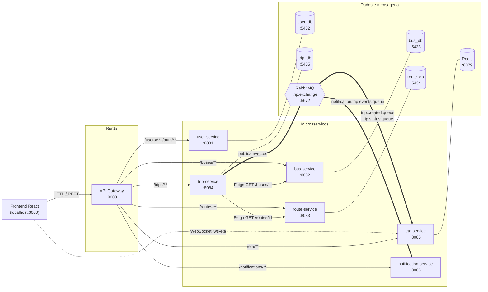
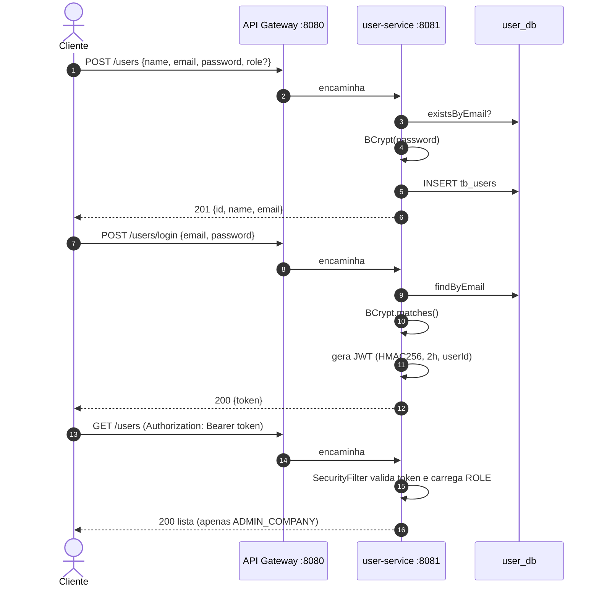
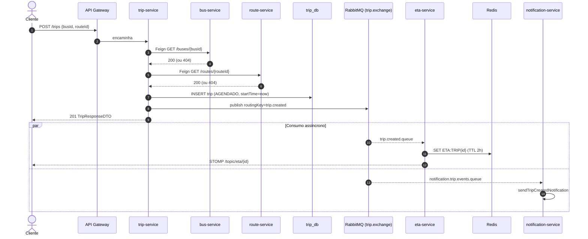
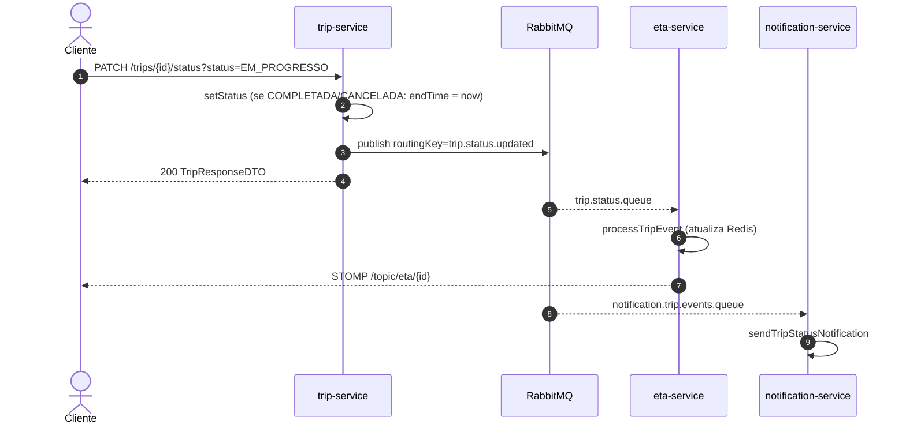
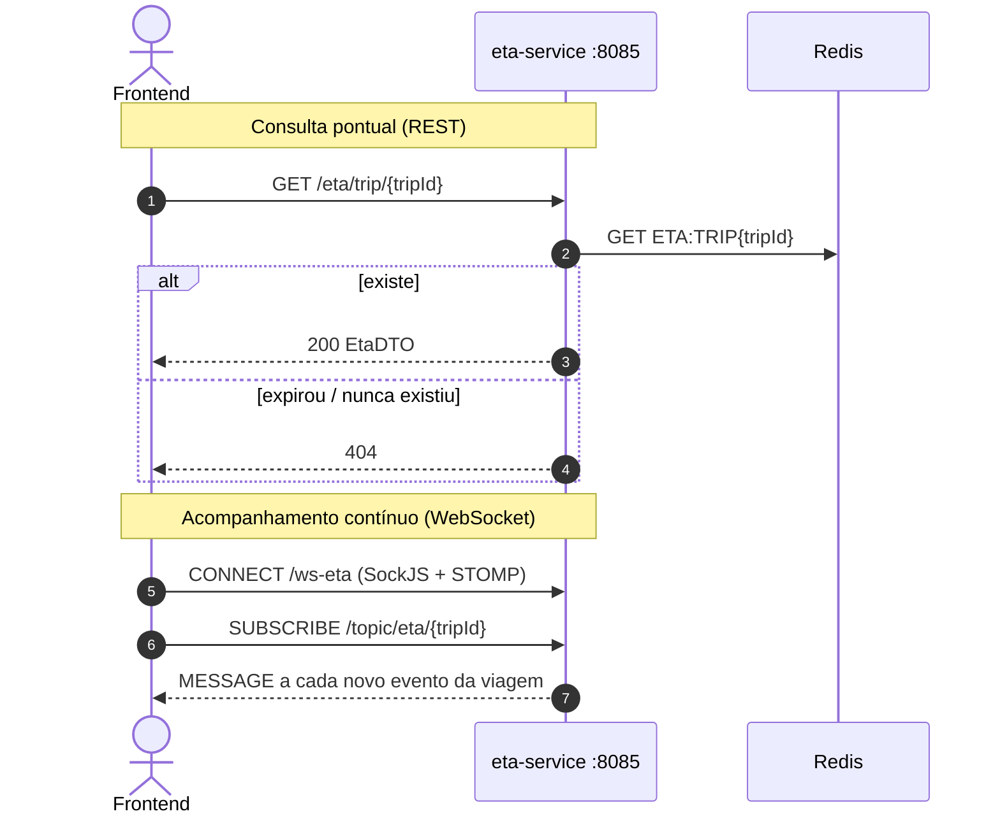
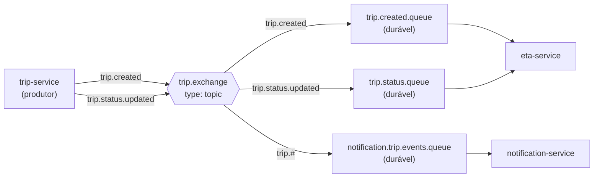
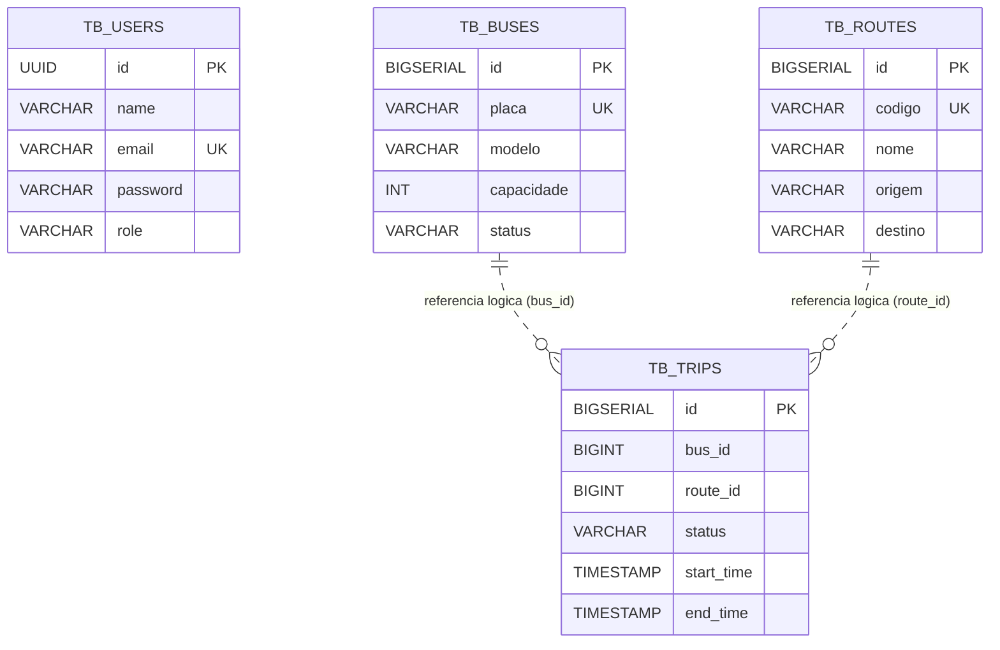

<div align="center">

# 🚌 AlertBus

**Plataforma de microsserviços para gestão de frota, rotas e viagens de ônibus, com estimativa de chegada (ETA) em tempo real e notificações por eventos.**

<br/>

<table>
  <tr>
    <td align="center" width="110"><br/><sub><b>Java 21</b></sub></td>
    <td align="center" width="110"><br/><sub><b>Spring Boot</b></sub></td>
    <td align="center" width="110"><br/><sub><b>Maven</b></sub></td>
    <td align="center" width="110"><br/><sub><b>PostgreSQL 16</b></sub></td>
    <td align="center" width="110"><br/><sub><b>RabbitMQ</b></sub></td>
    <td align="center" width="110"><br/><sub><b>Redis 7</b></sub></td>
    <td align="center" width="110"><br/><sub><b>Docker</b></sub></td>
    <td align="center" width="110"><br/><sub><b>JUnit 5</b></sub></td>
    <td align="center" width="110"><br/><sub><b>OpenAPI</b></sub></td>
  </tr>
</table>

<br/>


</div>

---

## 1. Visão geral

O **AlertBus** é um sistema distribuído, construído em **arquitetura de microsserviços** com Spring Boot, que permite:

- **Cadastrar e autenticar usuários** com perfis distintos (administrador da empresa, motorista e passageiro), usando **JWT**;
- **Gerenciar a frota** (ônibus, placas, capacidade e status operacional);
- **Gerenciar rotas/linhas** (código, nome, origem e destino);
- **Criar e acompanhar viagens**, associando um ônibus a uma rota e controlando o ciclo de vida da viagem;
- **Propagar eventos de viagem de forma assíncrona** via RabbitMQ;
- **Calcular e expor o ETA** (tempo estimado de chegada) com cache em Redis e **atualização em tempo real via WebSocket**;
- **Emitir notificações** a partir dos eventos de viagem.

Todo o tráfego externo entra por um único ponto, o **API Gateway** (porta `8080`), que roteia as requisições para o serviço correto.


---

## 2. Stack tecnológica

| Camada | Tecnologia | Versão / Observação | Onde é usada |
|---|---|---|---|
| Linguagem | **Java** | 21 | Todos os serviços |
| Framework | **Spring Boot** | 4.1.1 (gateway em 3.3.5) | Todos os serviços |
| Gateway | **Spring Cloud Gateway** | Spring Cloud 2023.0.3 (reativo / WebFlux) | `api-gateway` |
| Comunicação síncrona | **Spring Cloud OpenFeign** | Spring Cloud 2025.1.2 | `trip-service` → `bus-service` / `route-service` |
| Persistência | **Spring Data JPA** + **Hibernate** | `ddl-auto: validate` | user, bus, route, trip |
| Banco relacional | **PostgreSQL** | 16-alpine (um banco por serviço) | user, bus, route, trip |
| Migrations | **Flyway** | `flyway-core` / `flyway-database-postgresql` | user, bus, route, trip |
| Mensageria | **RabbitMQ** | 3-management (Topic Exchange) | trip (produtor); eta e notification (consumidores) |
| Cache / estado | **Redis** | 7-alpine | `eta-service` |
| Tempo real | **WebSocket (STOMP + SockJS)** | `spring-boot-starter-websocket` | `eta-service` |
| Segurança | **Spring Security** + **BCrypt** | stateless, CSRF desabilitado | `user-service` |
| Token | **java-jwt (Auth0)** | 4.4.0, HMAC256 | `user-service` |
| Validação | **Jakarta Bean Validation** | `spring-boot-starter-validation` | user, bus, route, trip |
| Documentação da API | **springdoc-openapi (Swagger UI)** | 3.1.0 | `user-service` |
| Produtividade | **Lombok** | — | user, bus, route, trip, gateway |
| Config. local | **dotenv-java** | 3.1.0 | `user-service` |
| Build | **Maven** + **Maven Wrapper** | `mvnw` em cada módulo | Todos |
| Containers | **Docker Compose** | Infra (bancos, RabbitMQ, Redis) | Raiz |
| Testes | **JUnit 5**, **Mockito**, **AssertJ**, **Spring MockMvc**, **Hamcrest** | ver [seção 12](#12-testes) | Todos |

---

## 3. Arquitetura

### 3.1 Visão macro



### 3.2 Princípios arquiteturais adotados

| Princípio | Como aparece no projeto |
|---|---|
| **Database per Service** | Cada serviço com persistência relacional tem seu próprio PostgreSQL (`user_db`, `bus_db`, `route_db`, `trip_db`). Não existem *foreign keys* entre bancos; as referências (`bus_id`, `route_id`) são lógicas e validadas via HTTP. |
| **API Gateway** | Ponto único de entrada (`:8080`), com CORS global e roteamento por *path*. |
| **Comunicação síncrona + assíncrona** | Síncrona via **Feign** (validação de ônibus/rota na criação da viagem); assíncrona via **RabbitMQ** (eventos de viagem). |
| **Event-driven** | O `trip-service` publica eventos; `eta-service` e `notification-service` reagem de forma desacoplada, cada um com a sua fila. |
| **Cache de leitura rápida** | O ETA mais recente de cada viagem fica no Redis, com TTL de 2 horas. |
| **Push em tempo real** | O `eta-service` empurra cada evento para os clientes via STOMP em `/topic/eta/{tripId}`. |
| **Schema versionado** | Flyway cria as tabelas; o Hibernate apenas **valida** (`ddl-auto: validate`). |
| **Camadas internas** | `controller` → `service` → `repository` → `entity`, com `dto` (records Java) na fronteira da API. |

### 3.3 Mapa de serviços e portas

| Serviço | Porta | Responsabilidade | Banco / Infra | Papel na mensageria |
|---|---|---|---|---|
| `api-gateway` | **8080** | Roteamento, CORS, filtro global de autenticação | — | — |
| `user-service` | **8081** | Usuários, login, emissão e validação de JWT | PostgreSQL `user_db` (5432) | — |
| `bus-service` | **8082** | Cadastro e status de ônibus | PostgreSQL `bus_db` (5433) | — |
| `route-service` | **8083** | Cadastro de rotas | PostgreSQL `route_db` (5434) | — |
| `trip-service` | **8084** | Viagens e ciclo de vida | PostgreSQL `trip_db` (5435) + Feign | **Produtor** |
| `eta-service` | **8085** | ETA em Redis + push via WebSocket | Redis (6379) | **Consumidor** |
| `notification-service` | **8086** | Notificações sobre eventos de viagem | — | **Consumidor** |
| RabbitMQ | 5672 / **15672** (UI) | Broker de mensagens | volume `rabbitmq_data` | — |

### 3.4 Arquitetura interna de um serviço (padrão)

```
alertbus.<servico>
├── controller/   → endpoints REST (@RestController)
├── service/      → regras de negócio (@Service, @Transactional)
├── repository/   → Spring Data JPA (JpaRepository)
├── entity/       → entidades JPA (+ enums de status)
├── dto/          → records de request/response (+ validações Jakarta)
├── client/       → clients Feign (somente trip-service)
├── config/       → RabbitMQ, Redis, WebSocket
├── listener/     → @RabbitListener (eta e notification)
├── security/     → SecurityConfig / SecurityFilter (somente user-service)
└── exception/    → @RestControllerAdvice (somente trip-service)
```

---

## 4. Estrutura do repositório

```
alertBus/
├── .env.example               # Modelo de variáveis de ambiente
├── .gitignore
├── docker-compose.yml         # Infra: 4x PostgreSQL, RabbitMQ, Redis
├── pom.xml                    # POM raiz (agregador; lista 4 módulos)
│
├── api-gateway/               # Spring Cloud Gateway (porta 8080)
│   └── src/main/java/alertbus/api_gateway/filter/GlobalAuthFilter.java
│
├── user-service/              # Autenticação e usuários (porta 8081)
│   └── src/main/resources/db/migration/   (V1, V2)
│
├── bus-service/               # Frota (porta 8082)
│   └── src/main/resources/db/migration/   (V1)
│
├── route-service/             # Rotas (porta 8083)
│   └── src/main/resources/db/migration/   (V1)
│
├── trip-service/              # Viagens + produtor de eventos (porta 8084)
│   └── src/main/resources/db/migration/   (V1)
│
├── eta-service/               # ETA + Redis + WebSocket (porta 8085)
│
└── notification-service/      # Notificações (porta 8086)
```

Cada módulo possui seu próprio `pom.xml`, `mvnw`/`mvnw.cmd` e pasta `src/test`.

---

## 5. Microsserviços em detalhe

### 5.1 `api-gateway` — porta 8080

**Tecnologias:** Spring Boot 3.3.5, Spring Cloud Gateway (WebFlux), Lombok.

**Rotas configuradas** (`application.yaml`):

| ID | Predicado `Path` | Destino |
|---|---|---|
| `user-service` | `/users/**`, `/auth/**` | `http://localhost:8081` |
| `bus-service` | `/buses/**` | `http://localhost:8082` |
| `route-service` | `/routes/**` | `http://localhost:8083` |
| `trip-service` | `/trips/**` | `http://localhost:8084` |
| `eta-service` | `/eta/**` | `http://localhost:8085` |
| `notification-service` | `/notifications/**` | `http://localhost:8086` |

**CORS global:** origem permitida `http://localhost:3000` (frontend React); métodos `GET, POST, PUT, DELETE, OPTIONS`; todos os headers.

**`GlobalAuthFilter`** (`GlobalFilter` com `order = -1`, executa antes dos demais):
- libera caminhos que contenham `/auth/login` ou `/auth/register`;
- para os demais, se **não houver o header `Authorization`**, responde `401 Unauthorized` e interrompe a cadeia;
- **não valida a assinatura/expiração do JWT** — apenas verifica a presença do header (a validação real ocorre no `user-service`).


---

### 5.2 `user-service` — porta 8081

**Responsabilidade:** cadastro de usuários, login e emissão/validação de JWT.

**Endpoints** (prefixo `/users`):

| Método | Rota | Acesso | Descrição |
|---|---|---|---|
| `POST` | `/users` | Público | Cria usuário (perfil padrão `PASSENGER`) → `201` |
| `POST` | `/users/login` | Público | Autentica e retorna `{ "token": "..." }` |
| `GET` | `/users` | `ROLE_ADMIN_COMPANY` | Lista todos os usuários |
| `GET` | `/users/{id}` | Autenticado | Busca por UUID |
| — | `/swagger-ui.html`, `/v3/api-docs/**` | Público | Documentação OpenAPI |

**Modelo de dados — `tb_users`:** `id (UUID)`, `name`, `email (único)`, `password (BCrypt)`, `role`.

**Perfis (`UserRole`):** `ADMIN_COMPANY`, `DRIVER`, `PASSENGER`.

**Regras de negócio:**
- e-mail duplicado → `IllegalArgumentException("E-mail já cadastrado no sistema.")`;
- senha sempre armazenada com **BCrypt**;
- se `role` não for informado, assume `PASSENGER`;
- a resposta (`UserResponseDTO`) **nunca expõe a senha** — apenas `id`, `name`, `email`;
- login com e-mail inexistente ou senha incorreta → mensagem genérica de credenciais inválidas.

**JWT (`TokenService`):**

| Atributo | Valor |
|---|---|
| Algoritmo | HMAC256 |
| Segredo | propriedade `api.security.token.secret` (há um *default* no código) |
| Issuer | `alert-bus-service` |
| Subject | e-mail do usuário |
| Claim extra | `userId` |
| Validade | 2 horas |

**Pipeline de segurança:** `SecurityFilter` (`OncePerRequestFilter`, antes do `UsernamePasswordAuthenticationFilter`) lê `Authorization: Bearer <token>`, valida o token, carrega o usuário pelo e-mail e registra no `SecurityContext` a authority `ROLE_<role>`. Sessão **stateless**, CSRF desabilitado.

---

### 5.3 `bus-service` — porta 8082

**Responsabilidade:** CRUD parcial da frota.

| Método | Rota | Descrição |
|---|---|---|
| `POST` | `/buses` | Cadastra ônibus → `201` (`400` se validação falhar) |
| `GET` | `/buses` | Lista todos |
| `GET` | `/buses/{id}` | Busca por ID |
| `PATCH` | `/buses/{id}/status?status=` | Altera o status operacional |

**Modelo — `tb_buses`:** `id (BIGSERIAL)`, `placa (único, até 10 caracteres)`, `modelo`, `capacidade`, `status`.

**`BusStatus`:** `disponivel`, `em_viagem`, `manutencao`, `inativo`.

**Validações:** `placa` obrigatória (`@NotBlank`), `status` obrigatório (`@NotNull`). Placa duplicada é rejeitada na camada de serviço.

---

### 5.4 `route-service` — porta 8083

**Responsabilidade:** cadastro de rotas/linhas.

| Método | Rota | Descrição |
|---|---|---|
| `GET` | `/routes` | Lista todas |
| `GET` | `/routes/{id}` | Busca por ID |
| `POST` | `/routes` | Cria rota → `201` |
| `DELETE` | `/routes/{id}` | Remove rota → `204` |

**Modelo — `tb_routes`:** `id (BIGSERIAL)`, `codigo (único, máx. 20)`, `nome`, `origem`, `destino`.

**Validações:** `codigo` obrigatório e com no máximo 20 caracteres; `nome` obrigatório; código duplicado é rejeitado.

---

### 5.5 `trip-service` — porta 8084

**Responsabilidade:** orquestrar o ciclo de vida das viagens e **publicar os eventos** que alimentam o restante do sistema.

| Método | Rota | Descrição |
|---|---|---|
| `GET` | `/trips` | Lista viagens |
| `GET` | `/trips/{id}` | Busca por ID (`404` se não existir) |
| `POST` | `/trips` | Cria viagem a partir de `{ "busId": 1, "routeId": 2 }` |
| `PATCH` | `/trips/{id}/status?status=` | Atualiza o status da viagem |

**Modelo — `tb_trips`:** `id`, `bus_id`, `route_id`, `status`, `start_time`, `end_time`.

**`TripStatus`:** `AGENDADO` → `EM_PROGRESSO` → `COMPLETADA` | `CANCELADA`.

**Regras de negócio:**
1. **Criação:** valida a existência do ônibus (`BusClient`) e da rota (`RouteClient`) por Feign. Ônibus não encontrado → `IllegalArgumentException` (HTTP 400); rota não encontrada → `RuntimeException` (HTTP 404). Se válidos, salva a viagem com status `AGENDADO` e `startTime = agora`, e publica o evento `trip.created`.
2. **Atualização de status:** altera o status; se for `COMPLETADA` ou `CANCELADA`, preenche `endTime`. Em seguida publica o evento `trip.status.updated`.
3. Nenhum evento é publicado se a validação ou a busca falhar.

**Tratamento de erros (`GlobalExceptionHandler`):** `RuntimeException` → `404` com `{ "error": "..." }`; `IllegalArgumentException` → `400` com `{ "error": "..." }`.

---

### 5.6 `eta-service` — porta 8085

**Responsabilidade:** consumir eventos de viagem, manter o **ETA no Redis** e **empurrar atualizações** para os clientes via WebSocket.

**REST:**

| Método | Rota | Descrição |
|---|---|---|
| `GET` | `/eta/trip/{tripId}` | Retorna o ETA da viagem (`200`) ou `404` se não houver |

**Resposta (`EtaDTO`):** `tripId`, `busId`, `routeId`, `estimatedMinutesRemaining`, `status`.

**WebSocket (STOMP sobre SockJS):**

| Item | Valor |
|---|---|
| Endpoint de conexão | `/ws-eta` (com fallback SockJS) |
| Prefixo de aplicação | `/app` |
| Broker simples | `/topic` |
| Tópico por viagem | `/topic/eta/{tripId}` |
| Origens permitidas | `*` (qualquer) |

**Redis:**
- chave: `"ETA:TRIP" + tripId` (ex.: `ETA:TRIP1`);
- valor: `EtaDTO` serializado em JSON;
- **TTL: 2 horas**;
- `RedisTemplate<String,Object>` com chaves em *string* e valores em JSON.

**Cálculo atual do ETA (placeholder):** `25` minutos para qualquer status, ou `0` quando o status é `"COMPLETED"`. O próprio código o descreve como "exemplo inicial de cálculo".

**Listeners (`TripEventListener`):** `trip.created.queue` e `trip.status.queue`. Para cada evento: (1) grava/atualiza o ETA no Redis; (2) publica o evento em `/topic/eta/{tripId}`.

---

### 5.7 `notification-service` — porta 8086

**Responsabilidade:** reagir aos eventos de viagem e disparar notificações.

- Declara a própria fila durável `notification.trip.events.queue` e a vincula à `trip.exchange` com a routing key **`trip.#`** — portanto recebe **todos** os eventos de viagem.
- `NotificationEventListener`: se o status for `AGENDADO` ou `CRIADO` (sem diferenciar maiúsculas/minúsculas) → `sendTripCreatedNotification`; qualquer outro status (inclusive `null`) → `sendTripStatusNotification`.
- `NotificationService`: **atualmente apenas imprime no console** (`[NOTIFICAÇÃO DISPARADA]` / `[ALERTA DE STATUS]`). Ainda não há canal real (push, e-mail, SMS).
- Não expõe endpoints REST próprios, embora o gateway já roteie `/notifications/**` para ele.

---

## 6. Fluxos principais

### 6.1 Cadastro e login (JWT)



### 6.2 Criação de viagem (síncrono + assíncrono)



### 6.3 Atualização de status da viagem



### 6.4 Consulta e acompanhamento do ETA em tempo real



---

## 7. Mensageria (RabbitMQ)

### 7.1 Topologia



| Elemento | Nome | Declarado por |
|---|---|---|
| Exchange (topic) | `trip.exchange` | `trip-service` e `notification-service` |
| Fila | `trip.created.queue` | `trip-service` |
| Fila | `trip.status.queue` | `trip-service` |
| Fila | `notification.trip.events.queue` | `notification-service` |
| Routing key | `trip.created` → `trip.created.queue` | `trip-service` |
| Routing key | `trip.status.updated` → `trip.status.queue` | `trip-service` |
| Binding | `trip.#` → `notification.trip.events.queue` | `notification-service` |

Todos os serviços usam `JacksonJsonMessageConverter` para serializar/deserializar as mensagens em **JSON**.

### 7.2 Contrato do evento (`TripEventDTO`)

```json
{
  "tripId": 12,
  "busId": 3,
  "routeId": 7,
  "status": "EM_PROGRESSO",
  "timestamp": "2026-10-03T14:35:10.123"
}
```

> No `trip-service` o `status` é o enum `TripStatus`; nos consumidores (`eta-service` e `notification-service`) é recebido como `String`.

---

## 8. Dados e migrations

Cada serviço com banco versiona o schema via **Flyway** (`classpath:db/migration`), e o Hibernate apenas **valida** o mapeamento.



> As linhas pontilhadas indicam **referências lógicas entre bancos diferentes** — não há FK física, pois cada tabela vive em um PostgreSQL distinto.

| Serviço | Migration | Conteúdo |
|---|---|---|
| user-service | `V1__create_table_tb_users.sql` | Cria `tb_users` |
| user-service | `V2__add_role_to_tb_users.sql` | Adiciona `role VARCHAR(50) NOT NULL DEFAULT 'PASSENGER'` |
| bus-service | `V1__create_table_tb_buses.sql` | Cria `tb_buses` (placa `UNIQUE`) |
| route-service | `V1__create_table_routes.sql` | Cria `tb_routes` (código `UNIQUE`) |
| trip-service | `V1__create_table_trips.sql` | Cria `tb_trips` |

**Redis (`eta-service`):** chave `ETA:TRIP{tripId}` → JSON do `EtaDTO`, TTL de 2 horas.

---

## 9. Infraestrutura (Docker Compose)

O `docker-compose.yml` sobe **apenas a infraestrutura** (os microsserviços são executados localmente via Maven):

| Container | Imagem | Portas (host:container) | Volume |
|---|---|---|---|
| `alertbus-user-db` | `postgres:16-alpine` | `5432:5432` | `user_db_data` |
| `alertbus-bus-db` | `postgres:16-alpine` | `5433:5432` | `bus_db_data` |
| `alertbus-route-db` | `postgres:16-alpine` | `5434:5432` | `route_db_data` |
| `alertbus-trip-db` | `postgres:16-alpine` | `5435:5432` | `trip_db_data` |
| `alertbus-rabbitmq` | `rabbitmq:3-management` | `5672:5672`, `15672:15672` | `rabbitmq_data` |
| `alertbus-eta-redis` | `redis:7-alpine` | `6379:6379` | `eta_redis_data` |

O banco do `user-service` possui *healthcheck* (`pg_isready`). O painel do RabbitMQ fica em **http://localhost:15672**.

---

## 10. Configuração e execução

### 10.1 Pré-requisitos

- **JDK 21**
- **Docker** e **Docker Compose**
- Maven (opcional — cada módulo traz o `mvnw`)

### 10.2 Variáveis de ambiente

Copie `.env.example` para `.env` e preencha **todas** as variáveis abaixo. O arquivo de exemplo atual traz apenas as do `user-service`; as demais são exigidas pelo `docker-compose.yml` e pelos `application.yaml`.

```env
# USER SERVICE & DB
USER_DB_NAME=user_db
USER_DB_USER=postgres
USER_DB_PASSWORD=sua_senha

# BUS SERVICE & DB
BUS_DB_NAME=bus_db
BUS_DB_USER=postgres
BUS_DB_PASSWORD=sua_senha

# ROUTE SERVICE & DB
ROUTE_DB_NAME=route_db
ROUTE_DB_USER=postgres
ROUTE_DB_PASSWORD=sua_senha

# TRIP SERVICE & DB
TRIP_DB_NAME=trip_db
TRIP_DB_USER=postgres
TRIP_DB_PASSWORD=sua_senha

# RABBITMQ (trip, eta e notification)
RABBITMQ_USER=guest
RABBITMQ_PASSWORD=guest

# (opcional) segredo do JWT — sobrescreve o valor default do código
# API_SECURITY_TOKEN_SECRET=troque-por-um-segredo-forte
```

> Os nomes dos bancos precisam coincidir com os das URLs JDBC dos `application.yaml`: `user_db`, `bus_db`, `route_db`, `trip_db`.

### 10.3 Passo a passo

```bash
# 1) Subir a infraestrutura
docker compose up -d

# 2) Exportar as variáveis do .env no terminal (Linux/macOS)
set -a; source .env; set +a

# 3) Subir os serviços (um terminal para cada)
cd trip-service         && ./mvnw spring-boot:run   # suba ANTES do eta-service (veja nota abaixo)
cd user-service         && ./mvnw spring-boot:run
cd bus-service          && ./mvnw spring-boot:run
cd route-service        && ./mvnw spring-boot:run
cd eta-service          && ./mvnw spring-boot:run
cd notification-service && ./mvnw spring-boot:run
cd api-gateway          && ./mvnw spring-boot:run
```

No Windows, use `mvnw.cmd` e defina as variáveis no terminal ou na configuração de execução da IDE.

> **Ordem de inicialização:** as filas `trip.created.queue` e `trip.status.queue` são declaradas pelo `trip-service`. O `eta-service` apenas as consome, então inicie o `trip-service` primeiro (ou crie as filas previamente) para evitar falha do listener por fila inexistente.

### 10.4 Verificando

| O que | Onde |
|---|---|
| Gateway | http://localhost:8080 |
| Swagger do user-service | http://localhost:8081/swagger-ui.html |
| Painel RabbitMQ | http://localhost:15672 |

### 10.5 Exemplo de uso (via Gateway)

```bash
# Criar usuário administrador
curl -X POST http://localhost:8080/users \
  -H "Content-Type: application/json" \
  -d '{"name":"Ana","email":"ana@alertbus.com","password":"123456","role":"ADMIN_COMPANY"}'

# Login
curl -X POST http://localhost:8080/users/login \
  -H "Content-Type: application/json" \
  -d '{"email":"ana@alertbus.com","password":"123456"}'
# → {"token":"eyJhbGciOi..."}

TOKEN="eyJhbGciOi..."

# Cadastrar ônibus
curl -X POST http://localhost:8080/buses \
  -H "Authorization: Bearer $TOKEN" -H "Content-Type: application/json" \
  -d '{"placa":"ABC-1234","modelo":"Marcopolo","capacidade":40,"status":"disponivel"}'

# Cadastrar rota
curl -X POST http://localhost:8080/routes \
  -H "Authorization: Bearer $TOKEN" -H "Content-Type: application/json" \
  -d '{"codigo":"101","nome":"Centro - Terminal","origem":"Centro","destino":"Terminal"}'

# Criar viagem (dispara evento trip.created)
curl -X POST http://localhost:8080/trips \
  -H "Authorization: Bearer $TOKEN" -H "Content-Type: application/json" \
  -d '{"busId":1,"routeId":1}'

# Iniciar a viagem (dispara trip.status.updated)
curl -X PATCH "http://localhost:8080/trips/1/status?status=EM_PROGRESSO" \
  -H "Authorization: Bearer $TOKEN"

# Consultar o ETA
curl http://localhost:8080/eta/trip/1 -H "Authorization: Bearer $TOKEN"
```

### 10.6 Consumindo o ETA em tempo real (frontend)

```javascript
import SockJS from "sockjs-client";
import { Client } from "@stomp/stompjs";

const client = new Client({
  webSocketFactory: () => new SockJS("http://localhost:8085/ws-eta"),
  onConnect: () => {
    client.subscribe("/topic/eta/1", (msg) => {
      const evento = JSON.parse(msg.body); // { tripId, busId, routeId, status, timestamp }
      console.log("Atualização da viagem:", evento);
    });
  },
});
client.activate();
```

> O gateway **não possui rota para `/ws-eta`**; o cliente conecta diretamente na porta `8085`, ou é preciso adicionar uma rota de WebSocket no gateway.

---

## 11. Segurança

| Aspecto | Implementação |
|---|---|
| Armazenamento de senha | BCrypt (`BCryptPasswordEncoder`) |
| Autenticação | JWT HMAC256 emitido pelo `user-service`, validade de 2 h |
| Autorização | RBAC por perfil: `ADMIN_COMPANY`, `DRIVER`, `PASSENGER` (aplicado hoje apenas no `user-service`) |
| Sessão | Stateless (`SessionCreationPolicy.STATELESS`) |
| CSRF | Desabilitado (API stateless) |
| Exposição de dados | DTOs de resposta não retornam senha |
| CORS | Gateway permite apenas `http://localhost:3000` |
| Segredos | Credenciais via variáveis de ambiente; `.env` está no `.gitignore` |

**Regras de acesso do `user-service`:**

| Requisição | Acesso |
|---|---|
| `POST /users`, `POST /users/login`, Swagger | Público |
| `GET /users` | `ADMIN_COMPANY` |
| Qualquer outra | Autenticado |

---

## 12. Testes

### 12.1 Estratégia

O projeto adota uma estratégia focada em **testes unitários e de fatia (slice) isolados**, sem depender de infraestrutura real:

| Tipo | Ferramentas | O que cobre |
|---|---|---|
| **Unitário de serviço** | JUnit 5 + Mockito (`@ExtendWith(MockitoExtension.class)`, `@Mock`, `@InjectMocks`) + AssertJ | Regras de negócio com repositórios, clients Feign, `RabbitTemplate` e `RedisTemplate` simulados; uso de `ArgumentCaptor` para inspecionar o que foi salvo/publicado |
| **Controller (web)** | `MockMvc` em modo `standaloneSetup` + Hamcrest/JsonPath | Status HTTP, serialização JSON, validação de entrada (`400`) e tratamento de erros, sem subir o contexto Spring |
| **Validação de DTO** | Jakarta `Validator` direto | Violações de `@NotBlank`, `@Email`, `@NotNull` |
| **Listeners (mensageria)** | Mockito (+ `InOrder`) | Ordem e destino do processamento (ETA → WebSocket; roteamento de notificações) |
| **Segurança** | Mockito + `SecurityContextHolder` | `SecurityFilter` (Bearer ausente/inválido/válido, usuário inexistente, authority por role) e `TokenService` (claims, assinatura, expiração, adulteração) |
| **Gateway** | `MockServerWebExchange` + `@ParameterizedTest` | `GlobalAuthFilter` (401 sem header, rotas públicas, ordem do filtro) |
| **Smoke** | `@SpringBootTest` (`contextLoads`) | Carregamento do contexto completo |

Técnicas recorrentes: **testes parametrizados** (`@ParameterizedTest` com `@EnumSource`, `@ValueSource`, `@CsvSource`, `@NullSource`), verificação de **ausência de efeitos colaterais** (`never()`) em cenários de erro e nomenclatura no padrão `metodo_cenario_resultadoEsperado`.

### 12.2 Inventário por serviço

| Serviço | Classes de teste | Métodos de teste* |
|---|---|---|
| `api-gateway` | `GlobalAuthFilterTest`, `ApiGatewayApplicationTests` | 5 |
| `user-service` | `UserControllerTest`, `UserServiceTest`, `TokenServiceTest`, `SecurityFilterTest`, `UserRequestDTOValidationTest`, `UserServiceApplicationTests` | 38 |
| `bus-service` | `BusControllerTest`, `BusServiceTest`, `BusServiceApplicationTests` | 16 |
| `route-service` | `RouteControllerTest`, `RouteServiceTest`, `RouteServiceApplicationTests` | 15 |
| `trip-service` | `TripControllerTest`, `TripServiceTest`, `TripRequestDTOValidationTest`, `TripServiceApplicationTests` | 27 |
| `eta-service` | `EtaControllerTest`, `EtaServiceTest`, `TripEventListenerTest`, `EtaServiceApplicationTests` | 12 |
| `notification-service` | `NotificationEventListenerTest`, `NotificationServiceTest`, `NotificationServiceApplicationTests` | 6 |
| **Total** | | **119** |

<sub>* Contagem de métodos anotados com `@Test` ou `@ParameterizedTest`. Os parametrizados executam várias vezes, então o número de execuções reportado pelo Maven é maior.</sub>

### 12.3 Destaques de cenários cobertos

- **trip-service:** criação só salva/publica se ônibus **e** rota existirem; verifica `routing key` correta (`trip.created` / `trip.status.updated`); `endTime` preenchido apenas em `COMPLETADA`/`CANCELADA`; falha de servidor no `bus-service` repassa a exceção original.
- **user-service:** senha codificada antes de salvar; role padrão `PASSENGER`; e-mail duplicado não persiste; token com claims corretos e **sem** senha/role; tokens com outro segredo, outro *issuer*, expirados, adulterados ou lixo retornam vazio.
- **bus / route:** duplicidade de placa/código não salva; 400 para payload inválido; PATCH com enum inválido retorna 400; DELETE inexistente não chama `deleteById`.
- **eta-service:** chave e TTL no Redis; valor do cache que não é `EtaDTO` retorna `null`; cada viagem usa seu próprio tópico WebSocket; `404` sem ETA e `400` com ID não numérico.
- **notification-service:** `AGENDADO`/`CRIADO` (qualquer caixa) → "viagem criada"; demais status e `null` → "mudança de status", sem lançar exceção.

### 12.4 Como executar

```bash
# Todos os testes de um serviço
cd trip-service && ./mvnw test

# Uma classe específica
./mvnw test -Dtest=TripServiceTest

# Um método específico
./mvnw test -Dtest=TripServiceTest#create_devePublicarEventoComRoutingKeyCreated

# Build sem testes
./mvnw clean package -DskipTests
```

> Os testes `*ApplicationTests` (`@SpringBootTest` / `contextLoads`) carregam o contexto completo e, portanto, esperam a infraestrutura do `docker-compose` ativa e as variáveis de ambiente definidas. Todos os demais testes são totalmente isolados.

### 12.5 Teste desabilitado conhecido

`TokenServiceTest.generateToken_emFusoUTC_deveExpirarEmAproximadamente2Horas` está com `@Disabled`, documentando um bug conhecido (veja [seção 14](#14-pontos-de-atenção-e-débitos-técnicos), item 4).

---

## 13. Referência rápida da API

Todas as rotas abaixo são acessadas via **Gateway** (`http://localhost:8080`).

| Serviço | Método | Rota | Corpo / Params | Resposta |
|---|---|---|---|---|
| user | POST | `/users` | `{name, email, password, role?}` | `201 {id, name, email}` |
| user | POST | `/users/login` | `{email, password}` | `200 {token}` |
| user | GET | `/users` | — | `200 [..]` (ADMIN_COMPANY) |
| user | GET | `/users/{uuid}` | — | `200 {id, name, email}` |
| bus | POST | `/buses` | `{placa, modelo, capacidade, status}` | `201 BusResponseDTO` |
| bus | GET | `/buses` | — | `200 [..]` |
| bus | GET | `/buses/{id}` | — | `200 BusResponseDTO` |
| bus | PATCH | `/buses/{id}/status` | `?status=disponivel\|em_viagem\|manutencao\|inativo` | `200 BusResponseDTO` |
| route | GET | `/routes` | — | `200 [..]` |
| route | GET | `/routes/{id}` | — | `200 RouteResponseDTO` |
| route | POST | `/routes` | `{codigo, nome, origem, destino}` | `201 RouteResponseDTO` |
| route | DELETE | `/routes/{id}` | — | `204` |
| trip | GET | `/trips` | — | `200 [..]` |
| trip | GET | `/trips/{id}` | — | `200 TripResponseDTO` / `404` |
| trip | POST | `/trips` | `{busId, routeId}` | `201 TripResponseDTO` |
| trip | PATCH | `/trips/{id}/status` | `?status=AGENDADO\|EM_PROGRESSO\|COMPLETADA\|CANCELADA` | `200 TripResponseDTO` |
| eta | GET | `/eta/trip/{tripId}` | — | `200 EtaDTO` / `404` |
| eta | WS | `/ws-eta` → `/topic/eta/{tripId}` | STOMP/SockJS (direto na porta 8085) | eventos da viagem |

---

